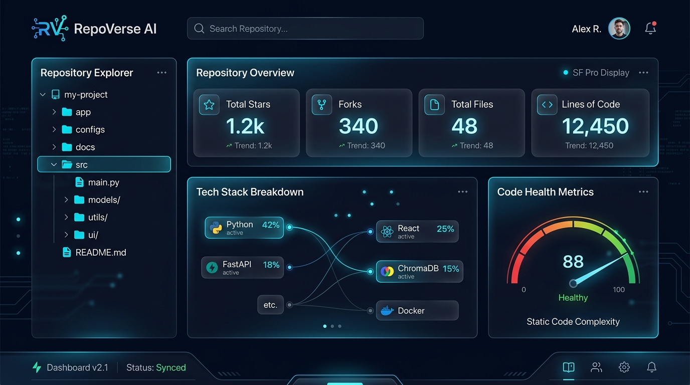
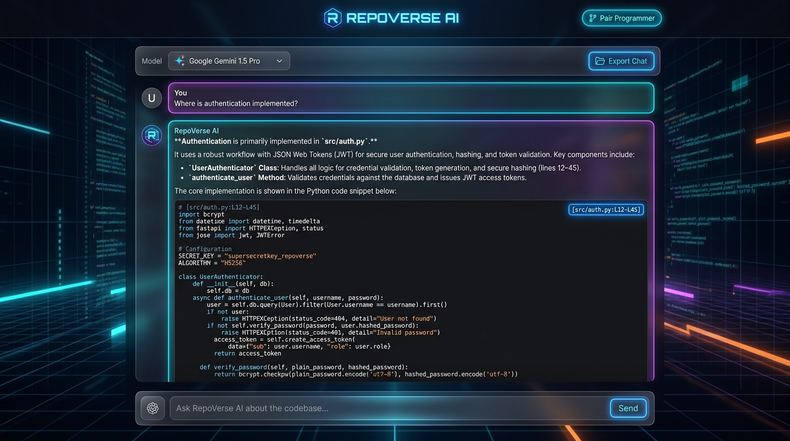
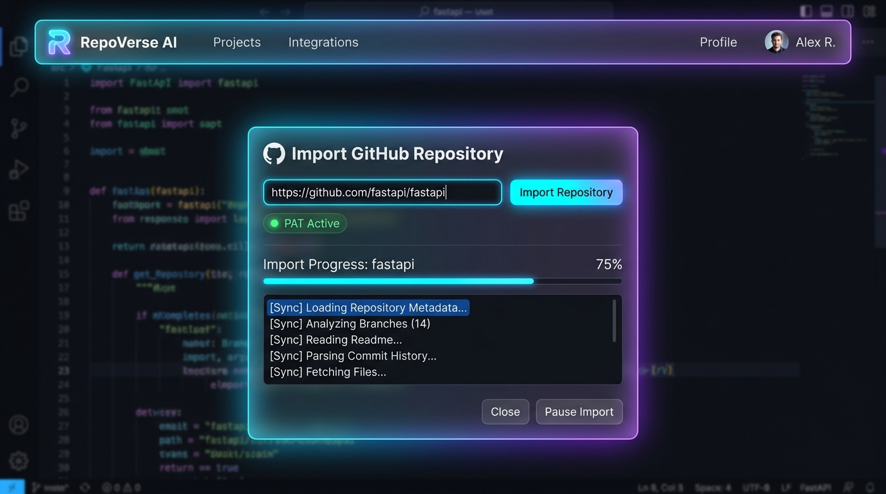
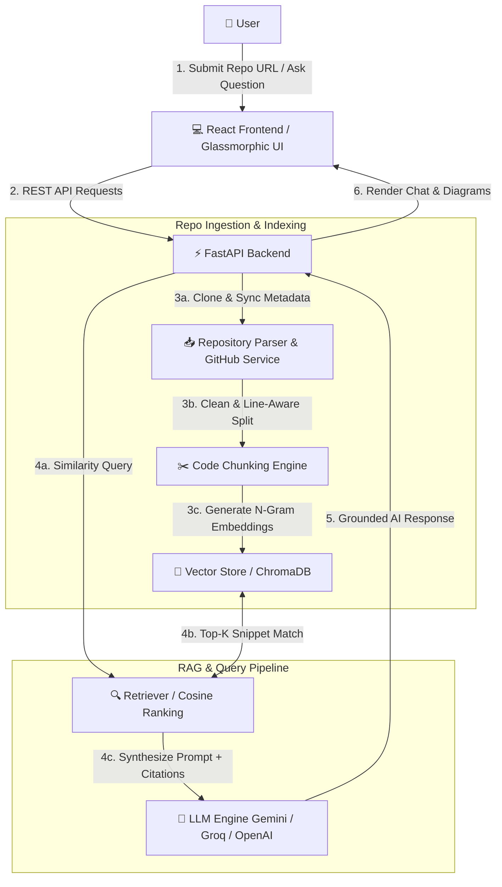

# RepoVerse 🚀

> **Understand Any GitHub Repository with AI**

[](https://github.com/)
[](https://www.python.org/)
[](https://fastapi.tiangolo.com/)
[](https://react.dev/)
[](https://github.com/)
[](https://www.trychroma.com/)
[](https://www.docker.com/)
[](LICENSE)

**RepoVerse** is an enterprise-grade, full-stack **Code Intelligence** platform designed to help developers, AI engineers, and software architects instantly explore, query, and comprehend any public GitHub repository. Powered by high-density **Retrieval-Augmented Generation (RAG)**, custom n-gram vector embeddings, line-aware code parsing, and multi-LLM reasoning, RepoVerse transforms complex codebases into an interactive conversational interface grounded in precise source lines and live repository metadata.

---

## 🎬 Product Demo

> [!NOTE]
> 🚧 **Demo Recording Placeholder**
> Place your demo GIF at `docs/demo.gif` to automatically display the product walkthrough here.
> 
> <!--  -->

---

## 📸 Screenshots

> [!TIP]
> **Screenshot Gallery Placeholders**
> Drop your UI screenshots into `docs/images/` to render them in the gallery below:

| Feature | Image Path | Status |
| :--- | :--- | :--- |
| **Repository Dashboard** | `docs/images/dashboard.png` | ⏳ *Pending Screenshot* |
| **Interactive Code Chat** | `docs/images/chat.png` | ⏳ *Pending Screenshot* |
| **GitHub Repo Importer** | `docs/images/import.png` | ⏳ *Pending Screenshot* |

<!--



-->

---

## ⚠️ Problem

Navigating and auditing large, unfamiliar GitHub repositories is one of the most time-consuming challenges faced by developers today:

- **High Onboarding Time**: Engineers spend days tracing module entry points, dependency chains, and internal data structures manually.
- **Context Loss**: Traditional search engines and standard LLMs lack fine-grained, line-level code citations and ground-truth context across multi-file repositories.
- **Outdated Documentation**: Most repositories suffer from incomplete, missing, or inaccurate `README` files and documentation.
- **Rate Limits & Noise**: Raw code dumps exceed token limits of standard AI models without intelligent filtering, line chunking, and semantic vector indexing.

---

## 💡 Solution

**RepoVerse** bridges the gap between raw codebase complexity and instantaneous understanding through intelligent **Generative AI** and deterministic codebase analysis:

1. **Automated GitHub Ingestion**: Dynamically clones public GitHub repositories, synchronizing real-time metadata (stars, forks, open issues, creation dates) via the GitHub REST API.
2. **Line-Aware Syntax Chunking**: Filters out build artifacts and binary noise, segmenting source code into contextual line-delimited chunks (`[src/auth.py:L12-L45]`) for accurate citations.
3. **Hybrid RAG & Vector Search**: Combines TF-IDF vectorization, n-gram feature extraction, and cosine relevance scoring with ChromaDB vector store support for sub-second snippet retrieval.
4. **Multi-LLM Reasoning Engine**: Supports Google Gemini (1.5/2.0), OpenAI (GPT-4o-mini), Groq (Llama 3.3 70B), and a zero-dependency offline local RAG synthesizer.

---

## ✨ Features

- **💬 Chat with Any GitHub Repository**: Ask natural language questions about architecture, business logic, or functions and get answers backed by line-numbered source code citations.
- **📊 AI Repository Summary & Stack Detector**: Automatically scans the repository structure to generate tech stack overviews, framework identification, and interactive folder trees.
- **🔍 Semantic Code Search**: Execute instant vector similarity searches across hundreds of source files with cosine scoring and keyword boosting.
- **🧠 RAG-Based Question Answering**: Grounded Retrieval-Augmented Generation prevents hallucination by feeding retrieved snippet contexts directly to LLMs.
- **📥 One-Click GitHub Importer**: Paste any repository URL or slug (`owner/repo`) with support for GitHub Personal Access Tokens for rate-limit protection.
- **⚡ Vector Embeddings & Indexing**: In-memory and vector database indexing optimized for large-scale source code text parsing.
- **🚀 High-Performance FastAPI Backend**: Built with asynchronous Python endpoints, CORS middleware, Pydantic validation, and streaming ready architecture.
- **🎨 Modern React & Cyberpunk Glassmorphic UI**: High-end responsive dark-mode interface featuring code syntax highlighting, dynamic tabs, and exportable Markdown chat history.

---

## 🏗️ Architecture

The following Mermaid diagram outlines the end-to-end data flow and system architecture of RepoVerse:



---

## 🛠️ Tech Stack

| Layer | Technologies & Tools |
| :--- | :--- |
| **Frontend** | HTML5, CSS3 (Vanilla Glassmorphism), Javascript (React UI Patterns), Highlight.js, Marked.js, Mermaid.js |
| **Backend** | Python 3.12+, FastAPI, Uvicorn, Pydantic, RESTful API Architecture |
| **AI & RAG Engine** | Retrieval-Augmented Generation (RAG), Google Gemini API, OpenAI GPT-4o-mini, Groq (Llama 3.3 70B), Local RAG Synthesizer |
| **Vector Store & Search** | TF-IDF / N-Gram Vectorizer, Cosine Similarity Search, ChromaDB Data Layer |
| **Integrations & Utilities** | GitHub REST API v3, Git Python, Static AST Cyclomatic Analysis |
| **Deployment & DevOps** | Docker, Docker Compose, GitHub Actions CI/CD Pipeline |

---

## 📂 Project Structure

```
repoverse/
├── .github/
│   └── workflows/
│       └── ci.yml                 # GitHub Actions CI/CD Pipeline
├── app/
│   ├── api/
│   │   └── routes.py              # FastAPI REST Endpoints & API Controllers
│   ├── core/
│   │   └── config.py              # Application Settings & Environment Config
│   ├── llm/
│   │   └── llm_service.py         # Multi-LLM Service (Gemini, Groq, OpenAI & Offline RAG)
│   ├── parser/
│   │   └── code_parser.py         # Multi-Language Crawler & Line-Aware Chunker
│   ├── rag/
│   │   └── vector_store.py        # Vector Store Indexing & Cosine Retrieval Engine
│   ├── services/
│   │   ├── github_service.py      # GitHub Importer, Metadata & REST API Client
│   │   └── summary_service.py     # Tech Stack Detector & Folder Tree Builder
│   └── static/
│       ├── app.js                 # Interactive Frontend Logic & Chat State Engine
│       ├── index.html             # Cyberpunk Glassmorphic Dark UI
│       └── styles.css             # Design System & Custom CSS Utilities
├── docs/
│   ├── images/                    # Project Screenshots
│   │   ├── dashboard.png
│   │   ├── chat.png
│   │   └── import.png
│   └── demo.gif                   # Product Demo GIF
├── storage/                       # Local Repo Cache & Vector Index Files
├── Dockerfile                     # Production Docker Image Definition
├── docker-compose.yml             # Docker Orchestration Configuration
├── .env                           # Environment Variables Configuration
├── demo.py                        # CLI Demonstration Script
├── main.py                        # FastAPI Server Entry Point
├── requirements.txt               # Python Dependencies
└── README.md                      # Product Documentation
```

---

## 🚀 Getting Started

### Prerequisites

- **Python 3.10+** installed on your system.
- **Docker & Docker Compose** *(optional, for containerized run)*.
- **GitHub Personal Access Token** *(optional, increases GitHub API rate limits)*.

---

### Option A: Local Python Setup

1. **Clone the Repository:**
   ```bash
   git clone https://github.com/TejasKumat8/RepoMind.git
   cd RepoMind
   ```

2. **Create and Activate Virtual Environment:**
   ```bash
   python -m venv .venv
   # On Windows PowerShell:
   .venv\Scripts\Activate.ps1
   # On Linux/macOS:
   source .venv/bin/activate
   ```

3. **Install Dependencies:**
   ```bash
   pip install -r requirements.txt
   ```

4. **Configure Environment Variables:**
   Create or edit `.env` in the project root:
   ```env
   PROJECT_NAME=RepoVerse
   HOST=127.0.0.1
   PORT=8000
   GITHUB_TOKEN=your_optional_github_pat_here
   GEMINI_API_KEY=your_optional_gemini_key_here
   ```

5. **Launch FastAPI Application:**
   ```bash
   python main.py
   ```
   Open your browser and navigate to `http://127.0.0.1:8000`.

---

### Option B: Docker Compose (1-Click Containerized Run) 🐳

Launch the full application stack in an isolated Docker container with one command:

```bash
docker-compose up -d
```

Access the UI at `http://127.0.0.1:8000`.

---

## 💡 Example Questions

Once a GitHub repository is imported into RepoVerse, try asking these sample prompts:

- 🔒 **"Where is authentication implemented in this repository?"**
- 🏛️ **"Explain the overall repository architecture and main entry points."**
- 🔑 **"How does user login and token validation work step-by-step?"**
- ⚡ **"Which API route or controller handles user creation and database persistence?"**
- 📋 **"Summarize this repository, its tech stack, and primary features."**
- 🛠️ **"Show me where configuration settings and environment variables are loaded."**

---

## 🔮 Future Roadmap

> *Note: These features represent conceptual design ideas planned for future development releases.*

- 📈 **Repository Health & Cyclomatic Risk Score**: Automated static code quality metrics dashboard highlighting complex files and maintenance debt.
- 📝 **AI Automated README Generator**: One-click generation of standardized open-source documentation based on vector codebase analysis.
- 🌐 **Multi-LLM Hybrid Orchestration**: Parallel model querying to synthesize consensus answers across Gemini, Claude, and OpenAI simultaneously.
- 🕸️ **Dead Code & Unused Export Detection**: AST-based static graph traversal to identify orphaned functions and unused dependencies.
- 🎨 **Interactive 3D Architecture Visualizer**: Dynamic visual node graphs mapping imports, file cross-references, and module dependencies.

---

## 🌟 Why RepoVerse?

- ⚡ **Reduce Onboarding Time by 80%**: Instantly understand complex codebases without reading hundreds of files line by line.
- 🎯 **Grounded Line Citations**: Every answer provides clickable file names and line ranges (`[app/core/config.py:L10-L22]`) for verification.
- 🔒 **Privacy-Conscious & Local RAG Capable**: Includes an offline RAG engine option that processes embeddings and snippets locally.
- 💼 **Recruiter & Hiring Manager Showcase**: Built with industry-standard backend, frontend, and AI engineering practices.

---

## 📄 Resume Ready Description

**RepoVerse — AI Codebase Intelligence & RAG Platform**
> Designed and built RepoVerse, a high-performance codebase intelligence platform enabling developers to query any GitHub repository using Retrieval-Augmented Generation (RAG), vector embeddings, and line-aware static code parsing. Architected asynchronous FastAPI endpoints, a responsive glassmorphic web UI, and integrated multi-LLM reasoning across Google Gemini, OpenAI, and Groq APIs alongside an offline vector retrieval engine. Containerized with Docker and configured with GitHub Actions CI/CD.

---

## 🏷️ Keywords & SEO

`AI Engineer` • `RAG` • `FastAPI` • `React` • `GitHub` • `Code Intelligence` • `Developer Tools` • `Semantic Search` • `Vector Database` • `LLM` • `Generative AI` • `Repository Analysis` • `ChromaDB` • `Python 3.12` • `Docker`

---

## 📜 License

Distributed under the MIT License. See `LICENSE` for details.
